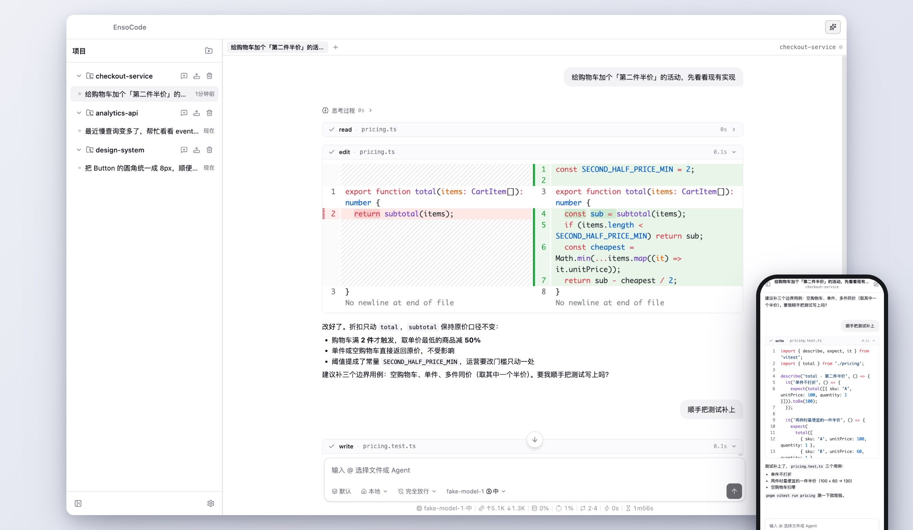
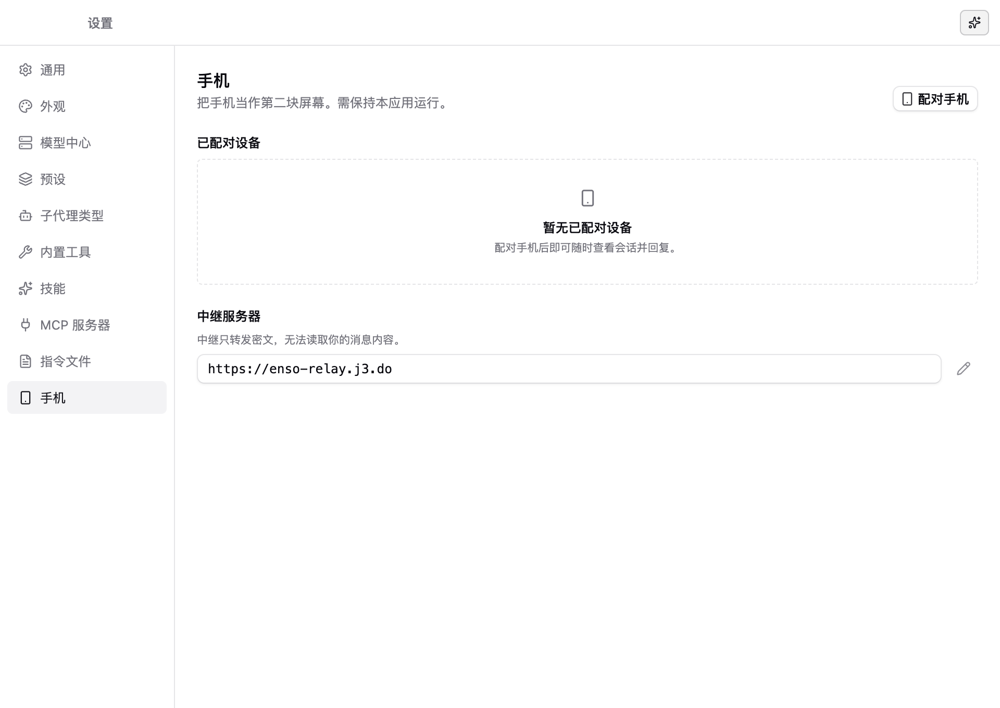
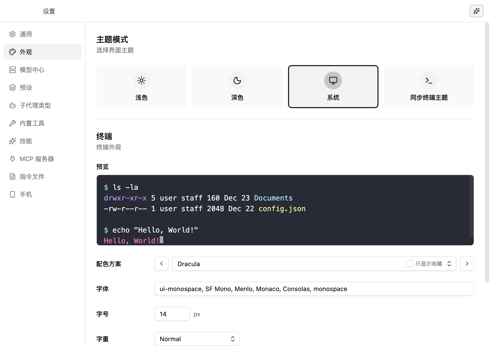

<p align="center">
  
</p>

<h1 align="center">EnsoCode</h1>

<p align="center">
  <b>一个人，带一队 Coding Agent</b>
</p>

<p align="center">
  
  
  
</p>

<p align="center">
  
</p>

> 购物车等着上「第二件半价」，events 表的慢查询在报警，设计系统的圆角还没统一——三个仓库各挂一个会话，Agent 并行开工，补丁、命令和目标都摊在时间线上，你只管验收。
> 人离开工位也不断线：审批与回合进度实时推到手机，路上点一下，Agent 接着干。

---

## 💡 为什么是 EnsoCode

EnsoCode 是基于 [pi](https://github.com/earendil-works/pi) 内核构建的本地桌面 Agent 工作台（Electron）。它不只帮你写单点代码，更负责**调度与协同多 Agent 队伍**：

- **分活有边界**：仓库挂进侧栏，一件事一个会话；同仓库并行开启独立 Git Worktree 隔离，互不踩踏。
- **任务按需派发**：长命令丢后台运行，单点一次性任务派 **Subagent**，需要多轮跟进与记忆对齐的雇 **Coworker**。
- **改动透明可控**：Diff 直接嵌入时间线，三档审批随时切，配备 Checkpoint 快照秒级回滚。
- **离座不断线**：手机端轻量 PWA 伴侣，端到端加密直连，在路上也能翻阅时间线、审批并推进任务。
- **无缝平替迁移**：一键扫入本机 Claude Code / Codex / Cursor 的配置、模型、MCP 与历史会话，开箱即用。

---

## ⚡ 核心特性

### 1. 分工调度：一件事一个会话，互不干扰

| 模式 / 机制 | 说明 |
| :--- | :--- |
| **多项目 & 多会话** | 侧栏聚合多个本地仓库。一件事一个独立会话：专属时间线、独立模型与预设，支持置顶与归档。 |
| **Worktree 隔离** | 默认在主工作树工作；支持一键切入独立 Git Worktree（`enso/` 分支）。同仓库多任务并行开发，代码改动物理隔离。 |
| **后台任务 (Process)** | 面向 Dev Server、Watch、长构建等纯进程任务。浮动于输入框上方，支持查看输出与终止，任务完成自动唤醒会话。 |
| **Subagent (外包子代理)** | 适合自包含的一次性独立任务。在隔离上下文中执行，任务完成交付报告即销毁；支持单轮并行派发多个。 |
| **Coworker (在编数字同事)** | 拥有独立 Tab 与持久化上下文的多轮子代理。支持直接在其 Tab 旁观、插话与追问，任务结束后随时解雇。 |

> **🛡️ Opt-in 的 Worktree 隔离机制**：
> 默认直接在主工作树开发；开启隔离后，自动在项目外托管独立 Worktree 与 `enso/` 分支。侧栏直观呈现未提交改动与未合并提交，归档/清理均有防丢拦截，未合并分支绝不静默丢失。

---

### 2. 审查与验收：时间线呈现，把控放行

| 能力 | 说明 |
| :--- | :--- |
| **内嵌 Diff 视图** | 基于现代 Diff 渲染器，文件读写与 Patch 改动在对话流中直观展开，无需反复跳出查看。 |
| **三档审批策略** | 提供 **全程逐项审批** / **自动接受编辑** / **完全放行** 三种档位，会话运行中可即时切换。 |
| **Git Checkpoint** | 写入前自动生成工作树快照（存入 `refs/enso-checkpoints`，每会话上限 50 个），代码改乱随时无损还原。 |

---

### 3. 跟进与协同：人离开，任务照常跑

| 能力 | 说明 |
| :--- | :--- |
| **目标模式 (`/goal`)** | 将当前核心目标钉在会话顶部，Agent 自动拆解并持续推进（上限 25 轮），支持随时暂停与继续。 |
| **插话队列 (Steer)** | Agent 执行期间支持将补充消息暂存队列（可随时编辑删除，轮末合并投递），紧急情况下支持立即 Steer 插队打断。 |
| **智能重试机制** | 遇到网络抖动或瞬态 API 报错时自动倒计时重试，状态条清晰显示剩余时间与重试轮次。 |
| **双屏手机伴侣** | 扫码即连的 PWA 伴侣端（端到端加密）。支持翻阅历史、插话、审批、回答交互式提问、推送通知直达。 |

<p align="center">
  
</p>

> **🔒 隐私与手机伴侣**：
> 手机端为纯 Web 标准 PWA，扫码即完成端到端加密（E2EE）握手。中继服务器（可自定义部署）仅透传密文；上行命令均经过白名单校验；系统推送由桌面直接向 Web Push 服务发起，不经过中继且不夹带对话私密文本。

---

### 4. 资产继承与个性化

| 能力 | 说明 |
| :--- | :--- |
| **技能、Slash 与 @ 引用** | 原生胶囊化 UI 展示，支持 `/skill:` 调起扩展技能，`@` 快速联想引用文件、Agent 类型与历史会话。 |
| **运行时预设 (Presets)** | 将模型策略、技能组、MCP 服务和系统 Prompt 固化为预设方案，开局锁定以确保环境稳定。 |
| **生态配置一键导入** | 自动扫描本机 Claude Code、Codex、Cursor 等环境，勾选导入模型 API、Skill、MCP 与 Instructions；支持直接导入历史对话。 |
| **Ghostty 主题与外观** | 内置 Ghostty 终端配色引擎，支持收藏、搜索、自动跟随系统明暗色，可自由调节背景图、毛玻璃透明度与模糊度。 |
| **可定制状态栏** | 自由勾选 Token 消耗、实时费用、运行耗时、上下文用量、Coworker 数量与审批档位。 |

<p align="center">
  
</p>

---

## 🛠️ 本地开发与构建

### 环境要求
- **Node.js**: `>= 22.0.0`
- **Package Manager**: [pnpm](https://pnpm.io) (`>= 10.0.0`)

### 快速启动

```bash
# 1. 安装依赖
pnpm install

# 2. 启动桌面开发模式
pnpm dev
```

### 多端打包

```bash
pnpm build:mac    # 构建 macOS 应用 (.dmg / .zip)
pnpm build:win    # 构建 Windows 安装包 (.exe)
pnpm build:linux  # 构建 Linux 安装包 (.AppImage / .deb)
```

### 代码质量检查

```bash
pnpm typecheck    # TypeScript 类型检查
pnpm lint         # Biome 静态代码规范检查
pnpm test         # 运行 Vitest 单元测试套件
```

---

## 📄 开源许可

本项目基于 [MIT License](LICENSE) 协议开源。
