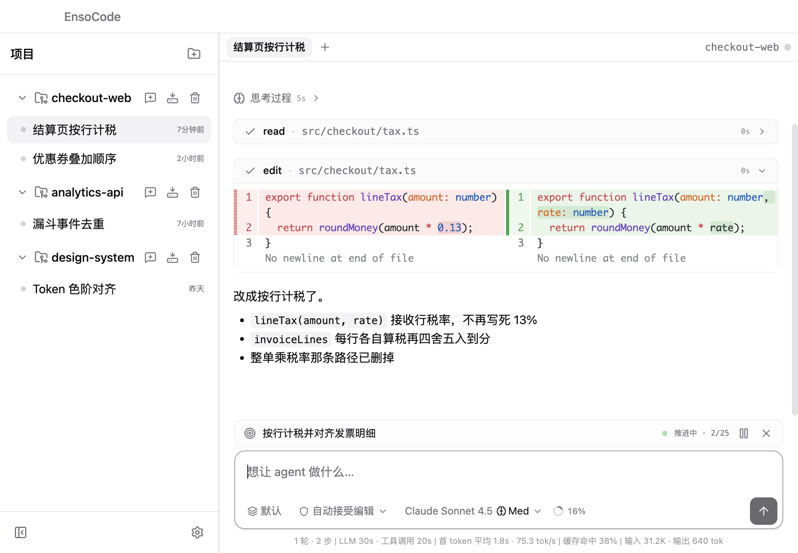

<p align="center">
  
</p>

<h1 align="center">EnsoCode</h1>

<p align="center">
  给 coding agent 一个能同时看住多个任务的桌面工作台
</p>

<p align="center">
  
  
  
  
</p>

<p align="center">
  
</p>

一边改结算页，一边盯分析接口，旁边还挂着设计系统——会话互不串，工具调用、补丁和目标都钉在时间线上。

## 做什么

EnsoCode 是本地 Electron 应用。把仓库、模型、技能和 MCP 收进一个窗口：多项目并行，长命令丢到后台，独立子任务交给 subagent，需要盯着跟进的活雇 coworker。技能以胶囊出现在输入框和对话里，改文件直接看 Diff，审批档位由你决定。

已有 Claude Code、Codex 或 Cursor 的配置，引导页可以扫进来；某个项目上的 Claude Code / Codex 会话也可以导入接着聊。

## 功能

| | |
| --- | --- |
| **多项目 / 多会话** | 侧栏同时挂多个仓库。每个会话有独立时间线、模型和预设。 |
| **后台任务** | `bash` 设 `background: true`，dev server、watch、长构建立刻返回。输入框上方一行一个，可展开输出、可停。结束会通知 agent。 |
| **Subagent** | 一次性、隔离上下文的子代理。适合能独立做完的活（调研一个模块、改一块独立代码）。同一条消息里多个 subagent 并行，交完报告就散。 |
| **Coworker** | 持久子代理：自己的 tab、自己积累上下文、可多轮追问。你可以旁观，也可以直接在 tab 里插话。干完再解散。 |
| **技能与斜杠胶囊** | 技能、斜杠命令在输入框和气泡里都是标签，不是一坨 XML。 |
| **预设** | 把技能、MCP 和指令文件捆成一套。对话开始后锁定，避免中途换栈。 |
| **导入本地应用** | 扫描 Claude Code、Codex、Cursor，勾选导入模型服务、技能、MCP 和全局指令。引导页和设置里都能做，每步可跳过。 |
| **导入会话** | 在当前项目下扫描 Claude Code、Codex 的历史对话，预览后导入，接着聊。 |
| **审批档位** | 工具调用按档位走：该停的停，该跑的跑。 |
| **内嵌 Diff** | 读文件、改文件都在时间线里展开，补丁不用跳到别处。 |
| **目标栏** | `/goal` 把当前任务钉在对话上方，长会话也不会跑偏。 |
| **Ghostty 主题** | 终端配色同步到界面，收藏、搜索、跟随系统深浅色。 |

### 后台任务、Subagent、Coworker

三者分管不同粒度，不要混用。

**后台任务**是进程，不是另一个 agent。启动开发服务、跑 watch、打一发很长的构建：设 `background: true`，不要在命令末尾加 `&`。状态挂在输入框上方，点开看尾部输出，做完会叫醒当前会话。

**Subagent** 是一次性外包。给它一份自包含的任务说明（它不会回头问你），在隔离上下文里读、改、跑命令，最后交一份报告。一条消息里派出多个，它们并行。适合「去把这个目录摸清楚」「把这个独立改动做掉」；不适合需要连续跟进、或你想随时插手的活。

**Coworker** 是雇来的同事。spawn 一次给角色和首个任务，之后 send 追问，上下文一直攒着。每个 coworker 占一个 tab，你可以看着它干活，也可以自己回一句。默认异步：主会话不用干等，轮次结束会通知。活干完要 dismiss，别养一堆闲人。一次性子任务用 subagent；要多轮、要你盯着、要同一份记忆，用 coworker。

### 从本地带过来

**导入本地应用**扫的是配置，不是聊天记录。首次启动或打开设置，从本机 Claude Code、Codex、Cursor 里勾选模型 API、技能、MCP 服务和指令文件。重复项会标出来，跳过任何一步都不影响之后再导。

**导入会话**扫的是某个项目目录下的对话历史，目前支持 Claude Code 和 Codex。选一条、预览消息、导入后变成 EnsoCode 会话，可以接着问。Cursor 的配置能导，会话历史目前不能。

<p align="center">
  
</p>

## 运行

需要 **Node.js 22+** 和 [pnpm](https://pnpm.io)。

```bash
pnpm i
pnpm dev
```

打包：

```bash
pnpm build:mac    # macOS
pnpm build:win    # Windows
pnpm build:linux  # Linux
```

首次启动会引导导入本地 AI 应用里的模型服务和资源，每一步都可以跳过，之后也能在设置里补。

## 许可

MIT
